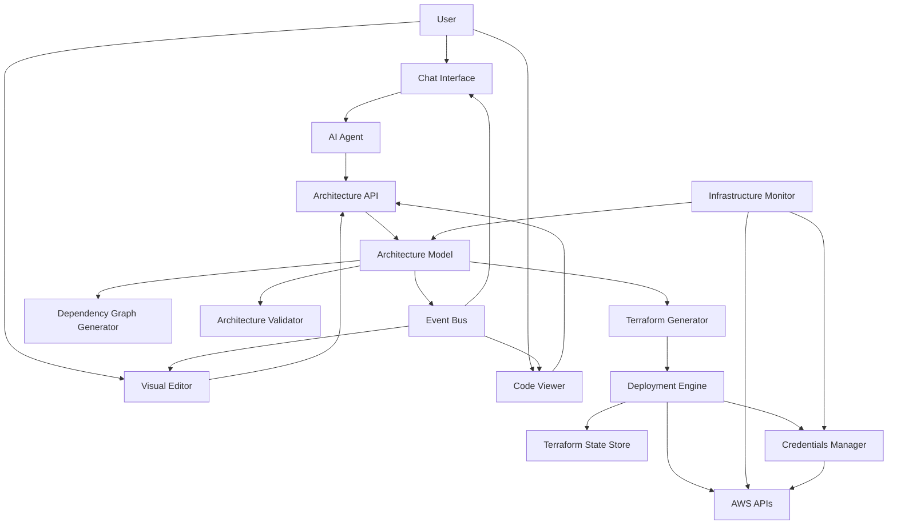

# Design Document: AI-Powered AWS Infrastructure Platform

## Overview

The AI-Powered AWS Infrastructure Platform is a comprehensive system that enables users to design, deploy, monitor, and manage AWS infrastructure through multiple interfaces: natural language chat, visual drag-and-drop editing, and direct Terraform code interaction. The platform bridges the gap between high-level infrastructure intent and low-level AWS resource provisioning.

The system follows a layered architecture where user interactions (via chat or visual editor) modify a central Architecture model, which is then transformed into Terraform code for deployment. The platform maintains bidirectional synchronization between all interfaces and provides real-time feedback during deployment and monitoring operations.

Key design principles:
- **Single Source of Truth**: The Architecture model is the canonical representation of infrastructure state
- **Multi-Interface Consistency**: All interfaces (chat, visual, code) remain synchronized
- **Declarative Infrastructure**: Users describe desired state; the platform handles provisioning
- **Real-Time Feedback**: Streaming updates during deployment and monitoring operations
- **Safety First**: Validation, confirmation prompts, and rollback capabilities prevent accidental changes

## Architecture

The platform consists of several interconnected subsystems:



### Component Responsibilities

1. **Chat Interface**: Accepts natural language input, displays AI responses and system notifications
2. **Visual Editor**: Provides drag-and-drop canvas for service placement and connection
3. **Code Viewer**: Displays generated Terraform code with syntax highlighting
4. **AI Agent**: Parses natural language, extracts infrastructure intent, generates responses
5. **Architecture API**: Provides CRUD operations for the Architecture model
6. **Architecture Model**: Central data structure representing infrastructure design
7. **Terraform Generator**: Converts Architecture model to Terraform HCL code
8. **Dependency Graph Generator**: Creates visual representation of service relationships
9. **Architecture Validator**: Validates AWS service configurations and relationships
10. **Deployment Engine**: Executes Terraform operations (plan, apply, destroy)
11. **Infrastructure Monitor**: Polls AWS for resource status and detects drift
12. **Credentials Manager**: Securely stores and retrieves AWS credentials
13. **Terraform State Store**: Persists Terraform state files
14. **Event Bus**: Broadcasts architecture changes to all interfaces for synchronization

## Components and Interfaces

### Architecture Model

The core data structure representing infrastructure design:

```typescript
interface Project {
  id: string;
  name: string;
  ownerId: string;
  architecture: Architecture;
  deploymentState: DeploymentState;
  createdAt: Date;
  updatedAt: Date;
}

interface Architecture {
  services: Map<string, ServiceInstance>;
  connections: Connection[];
  version: number;
  visualLayout: VisualLayout;
}

interface ServiceInstance {
  id: string;
  type: AWSServiceType;
  name: string;
  configuration: Record<string, any>;
  tags: Record<string, string>;
}

interface Connection {
  id: string;
  sourceServiceId: string;
  targetServiceId: string;
  relationshipType: RelationshipType;
  configuration: Record<string, any>;
}

enum RelationshipType {
  DEPENDS_ON = "depends_on",
  CONNECTS_TO = "connects_to",
  TRIGGERS = "triggers",
  READS_FROM = "reads_from",
  WRITES_TO = "writes_to"
}

interface VisualLayout {
  nodes: Map<string, NodePosition>;
  zoom: number;
  pan: { x: number; y: number };
}

interface NodePosition {
  x: number;
  y: number;
  width: number;
  height: number;
}

enum AWSServiceType {
  EC2 = "ec2",
  S3 = "s3",
  RDS = "rds",
  LAMBDA = "lambda",
  API_GATEWAY = "api_gateway",
  VPC = "vpc",
  SUBNET = "subnet",
  SECURITY_GROUP = "security_group",
  IAM_ROLE = "iam_role",
  CLOUDWATCH = "cloudwatch",
  // ... additional AWS services
}
```

### Architecture API

Provides operations for modifying the Architecture:

```typescript
interface ArchitectureAPI {
  // Service operations
  addService(projectId: string, service: ServiceInstance): Result<ServiceInstance>;
  updateService(projectId: string, serviceId: string, updates: Partial<ServiceInstance>): Result<ServiceInstance>;
  removeService(projectId: string, serviceId: string): Result<void>;
  getService(projectId: string, serviceId: string): Result<ServiceInstance>;
  
  // Connection operations
  addConnection(projectId: string, connection: Connection): Result<Connection>;
  removeConnection(projectId: string, connectionId: string): Result<void>;
  
  // Architecture operations
  getArchitecture(projectId: string): Result<Architecture>;
  validateArchitecture(projectId: string): Result<ValidationResult>;
  
  // History operations
  undo(projectId: string): Result<Architecture>;
  redo(projectId: string): Result<Architecture>;
  getHistory(projectId: string): Result<ArchitectureChange[]>;
}

interface ValidationResult {
  valid: boolean;
  errors: ValidationError[];
  warnings: ValidationWarning[];
}

interface ValidationError {
  serviceId?: string;
  connectionId?: string;
  message: string;
  code: string;
}
```

### AI Agent

Processes natural language and modifies architecture:

```typescript
interface AIAgent {
  processMessage(projectId: string, message: string, conversationHistory: Message[]): Promise<AIResponse>;
  extractIntent(message: string): Intent;
  generateClarifyingQuestions(intent: Intent): string[];
}

interface AIResponse {
  message: string;
  architectureChanges: ArchitectureChange[];
  clarifyingQuestions?: string[];
  confidence: number;
}

interface Intent {
  action: IntentAction;
  services: ServiceIntent[];
  connections: ConnectionIntent[];
  modifications: ModificationIntent[];
}

enum IntentAction {
  CREATE = "create",
  MODIFY = "modify",
  DELETE = "delete",
  QUERY = "query"
}

interface ServiceIntent {
  type: AWSServiceType;
  name?: string;
  configuration?: Record<string, any>;
}

interface ArchitectureChange {
  type: ChangeType;
  target: string;
  before?: any;
  after?: any;
  timestamp: Date;
}

enum ChangeType {
  SERVICE_ADDED = "service_added",
  SERVICE_MODIFIED = "service_modified",
  SERVICE_REMOVED = "service_removed",
  CONNECTION_ADDED = "connection_added",
  CONNECTION_REMOVED = "connection_removed"
}
```

### Terraform Generator

Converts Architecture to Terraform code:

```typescript
interface TerraformGenerator {
  generate(architecture: Architecture): Result<TerraformCode>;
  generateResource(service: ServiceInstance): string;
  generateDependencies(connections: Connection[]): string;
  generateProvider(credentials: AWSCredentials): string;
}

interface TerraformCode {
  provider: string;
  resources: Map<string, string>;
  outputs: Map<string, string>;
  variables: Map<string, string>;
  fullCode: string;
}
```

### Deployment Engine

Executes Terraform operations:

```typescript
interface DeploymentEngine {
  plan(projectId: string, terraformCode: TerraformCode): Promise<DeploymentPlan>;
  apply(projectId: string, plan: DeploymentPlan): Promise<DeploymentResult>;
  destroy(projectId: string): Promise<DeploymentResult>;
  getStatus(projectId: string): DeploymentStatus;
}

interface DeploymentPlan {
  resourcesToAdd: ResourceChange[];
  resourcesToModify: ResourceChange[];
  resourcesToDestroy: ResourceChange[];
  estimatedCost?: number;
}

interface ResourceChange {
  resourceType: string;
  resourceName: string;
  action: "create" | "update" | "delete";
  changes: Record<string, any>;
}

interface DeploymentResult {
  success: boolean;
  resourcesCreated: string[];
  resourcesFailed: string[];
  errors: DeploymentError[];
  duration: number;
  stateFile: string;
}

interface DeploymentStatus {
  state: "idle" | "planning" | "applying" | "destroying" | "error";
  progress: number;
  currentResource?: string;
  logs: DeploymentLog[];
}

interface DeploymentLog {
  timestamp: Date;
  level: "info" | "warning" | "error";
  message: string;
  resourceName?: string;
}
```

### Infrastructure Monitor

Tracks deployed resource status:

```typescript
interface InfrastructureMonitor {
  startMonitoring(projectId: string): void;
  stopMonitoring(projectId: string): void;
  getResourceStatus(projectId: string, resourceId: string): Promise<ResourceStatus>;
  getAllResourceStatuses(projectId: string): Promise<Map<string, ResourceStatus>>;
  detectDrift(projectId: string): Promise<DriftReport>;
}

interface ResourceStatus {
  resourceId: string;
  resourceType: string;
  state: ResourceState;
  healthStatus: "healthy" | "degraded" | "unhealthy" | "unknown";
  metrics: ResourceMetrics;
  lastChecked: Date;
}

enum ResourceState {
  CREATING = "creating",
  RUNNING = "running",
  STOPPED = "stopped",
  DELETING = "deleting",
  ERROR = "error",
  UNKNOWN = "unknown"
}

interface ResourceMetrics {
  [key: string]: number | string;
}

interface DriftReport {
  hasDrift: boolean;
  driftedResources: DriftedResource[];
  detectedAt: Date;
}

interface DriftedResource {
  resourceId: string;
  resourceType: string;
  expectedConfiguration: Record<string, any>;
  actualConfiguration: Record<string, any>;
  differences: ConfigurationDiff[];
}

interface ConfigurationDiff {
  property: string;
  expected: any;
  actual: any;
}
```

### Credentials Manager

Securely manages AWS credentials:

```typescript
interface CredentialsManager {
  storeCredentials(userId: string, credentials: AWSCredentials): Promise<Result<void>>;
  getCredentials(userId: string, accountId?: string): Promise<Result<AWSCredentials>>;
  validateCredentials(credentials: AWSCredentials): Promise<Result<boolean>>;
  updateCredentials(userId: string, accountId: string, credentials: AWSCredentials): Promise<Result<void>>;
  deleteCredentials(userId: string, accountId: string): Promise<Result<void>>;
  listAccounts(userId: string): Promise<Result<AWSAccount[]>>;
}

interface AWSCredentials {
  accountId: string;
  accountName: string;
  authenticationType: "access_key" | "iam_role";
  accessKeyId?: string;
  secretAccessKey?: string;
  roleArn?: string;
  region: string;
}

interface AWSAccount {
  accountId: string;
  accountName: string;
  region: string;
  isDefault: boolean;
}
```

### Event Bus

Synchronizes state across interfaces:

```typescript
interface EventBus {
  publish(event: PlatformEvent): void;
  subscribe(eventType: EventType, handler: EventHandler): Subscription;
  unsubscribe(subscription: Subscription): void;
}

interface PlatformEvent {
  type: EventType;
  projectId: string;
  payload: any;
  timestamp: Date;
}

enum EventType {
  ARCHITECTURE_CHANGED = "architecture_changed",
  SERVICE_ADDED = "service_added",
  SERVICE_MODIFIED = "service_modified",
  SERVICE_REMOVED = "service_removed",
  CONNECTION_ADDED = "connection_added",
  CONNECTION_REMOVED = "connection_removed",
  DEPLOYMENT_STARTED = "deployment_started",
  DEPLOYMENT_PROGRESS = "deployment_progress",
  DEPLOYMENT_COMPLETED = "deployment_completed",
  DEPLOYMENT_FAILED = "deployment_failed",
  RESOURCE_STATUS_CHANGED = "resource_status_changed",
  DRIFT_DETECTED = "drift_detected"
}

type EventHandler = (event: PlatformEvent) => void;
```

## Data Models

### Project Storage

Projects are stored with the following structure:

```
projects/
  {projectId}/
    metadata.json          # Project name, owner, timestamps
    architecture.json      # Current architecture state
    history/
      {version}.json       # Historical architecture versions
    terraform/
      generated.tf         # Generated Terraform code
      terraform.tfstate    # Terraform state file
    deployment/
      status.json          # Current deployment status
      logs/
        {timestamp}.log    # Deployment logs
```

### Architecture History

The platform maintains an append-only log of architecture changes:

```typescript
interface ArchitectureHistory {
  projectId: string;
  changes: ArchitectureChange[];
  currentVersion: number;
}

interface ArchitectureChange {
  version: number;
  type: ChangeType;
  target: string;
  before?: any;
  after?: any;
  timestamp: Date;
  userId: string;
  source: "chat" | "visual" | "api";
}
```

### Deployment State

Tracks the current deployment status:

```typescript
interface DeploymentState {
  projectId: string;
  status: DeploymentStatus;
  lastDeployment?: DeploymentRecord;
  terraformState?: string;
}

interface DeploymentRecord {
  deploymentId: string;
  startedAt: Date;
  completedAt?: Date;
  result: DeploymentResult;
  terraformPlan: DeploymentPlan;
}
```

### Credentials Storage

AWS credentials are encrypted at rest:

```typescript
interface CredentialRecord {
  userId: string;
  accountId: string;
  encryptedCredentials: string;  // AES-256 encrypted
  createdAt: Date;
  lastValidated: Date;
}
```


## Correctness Properties

*A property is a characteristic or behavior that should hold true across all valid executions of a system—essentially, a formal statement about what the system should do. Properties serve as the bridge between human-readable specifications and machine-verifiable correctness guarantees.*

### Property 1: Unique Project Identifiers

*For any* project creation operation, the generated project identifier should be unique across all existing projects, and the initial architecture should be empty.

**Validates: Requirements 1.1**

### Property 2: Non-Empty Project Names

*For any* project name input, if the name consists only of whitespace or is empty, the platform should reject it with a validation error; otherwise, it should accept and store the name.

**Validates: Requirements 1.2**

### Property 3: Project Ownership Isolation

*For any* user and any set of projects, querying projects for that user should return only projects owned by that user and no projects owned by other users.

**Validates: Requirements 1.3**

### Property 4: Data Persistence Round-Trip

*For any* project with architecture, deployment state, and visual layout, saving the project then loading it should produce equivalent data structures (architecture, deployment state, and visual layout should be preserved).

**Validates: Requirements 1.4, 1.6, 3.8, 4.6**

### Property 5: Project Deletion with Deployment Warning

*For any* project, when deleting the project, if infrastructure is currently deployed, the platform should provide a warning; after deletion, all project data should be removed from storage.

**Validates: Requirements 1.5, 9.8**

### Property 6: Service Addition from AI Intent

*For any* identified AWS service (given that the AI has extracted the intent), adding the service to the architecture should result in the service appearing in the architecture's service map with the correct type and configuration.

**Validates: Requirements 2.2**

### Property 7: Connection Creation from AI Intent

*For any* identified relationship between services (given that the AI has extracted the intent), creating the connection should result in a connection appearing in the architecture with the correct source, target, and relationship type.

**Validates: Requirements 2.3**

### Property 8: Clarifying Questions on Low Confidence

*For any* AI response with confidence below a defined threshold, the response should include clarifying questions to gather more information from the user.

**Validates: Requirements 2.4**

### Property 9: Architecture Modification Application

*For any* architecture and any valid modification intent, applying the modification should result in the architecture being updated according to the intent (services added/removed/modified, connections added/removed).

**Validates: Requirements 2.5**

### Property 10: Change Summary Generation

*For any* architecture modification, the platform should generate a summary that accurately describes what changed (which services were added/removed/modified, which connections were added/removed).

**Validates: Requirements 2.7**

### Property 11: Visual Service Creation

*For any* drag operation that adds a service from the palette, the architecture should contain a new service instance of the correct type at the specified position.

**Validates: Requirements 3.2**

### Property 12: Visual Connection Creation

*For any* drag operation that connects two existing services, the architecture should contain a new connection between those services with the appropriate relationship type.

**Validates: Requirements 3.3**

### Property 13: Immediate Architecture Updates

*For any* service property modification through any interface, the architecture should be updated immediately (within the same transaction) to reflect the new property values.

**Validates: Requirements 3.5**

### Property 14: Service Deletion with Dependency Updates

*For any* service deletion, the service should be removed from the architecture, and all connections referencing that service should also be removed.

**Validates: Requirements 3.6**

### Property 15: Cross-Interface Synchronization

*For any* architecture change made through one interface (chat, visual, or API), all other interfaces should receive an event notification containing the change details within a defined time window.

**Validates: Requirements 3.7, 10.1, 10.2, 10.3, 10.4, 10.6**

### Property 16: Architecture Validation on Modification

*For any* architecture modification, the platform should perform validation and return either a success result or a validation result containing specific errors and warnings.

**Validates: Requirements 4.1**

### Property 17: Descriptive Validation Errors

*For any* invalid architecture, the validation result should contain at least one error with a non-empty message and error code that identifies the specific validation issue.

**Validates: Requirements 4.2**

### Property 18: Undo-Redo Round-Trip

*For any* architecture state and any valid modification, applying the modification then undoing it should restore the original architecture state; subsequently redoing should restore the modified state.

**Validates: Requirements 4.3, 4.4**

### Property 19: Complete Change History

*For any* sequence of architecture modifications, the platform should maintain a history containing all changes in chronological order, with each change recording the type, target, before/after states, and timestamp.

**Validates: Requirements 4.5**

### Property 20: Deployment Impact Analysis

*For any* deployed architecture and any proposed changes, the platform should generate a deployment plan that accurately identifies which resources will be added, modified, or destroyed.

**Validates: Requirements 4.7, 7.9**

### Property 21: Dependency Graph Completeness

*For any* architecture, the generated dependency graph should contain exactly one node for each service in the architecture and exactly one directed edge for each connection in the architecture.

**Validates: Requirements 5.1, 5.2, 5.3**

### Property 22: Dependency Graph Synchronization

*For any* architecture change, the dependency graph should be regenerated to reflect the new architecture state (nodes and edges should match the updated services and connections).

**Validates: Requirements 5.6**

### Property 23: Circular Dependency Detection

*For any* architecture containing a cycle in the dependency graph (where following connections from a service eventually leads back to that same service), the platform should detect and indicate the presence of the cycle.

**Validates: Requirements 5.7**

### Property 24: Valid Terraform Generation

*For any* valid architecture, the generated Terraform code should be syntactically valid HCL and should include a provider configuration, a resource block for each service, and dependency declarations for each connection.

**Validates: Requirements 6.1, 6.2, 6.3, 6.4**

### Property 25: Terraform Configuration Completeness

*For any* service with configuration properties, the generated Terraform resource block for that service should include all specified properties with their correct values.

**Validates: Requirements 6.5**

### Property 26: Terraform Generation Error Handling

*For any* invalid architecture, attempting to generate Terraform code should return an error result with descriptive error messages explaining why the architecture cannot be converted to Terraform.

**Validates: Requirements 6.8**

### Property 27: Deployment Credential Validation

*For any* deployment initiation, if AWS credentials are not configured or are invalid, the deployment should fail immediately with an error indicating the credential issue.

**Validates: Requirements 7.1**

### Property 28: Deployment Status Updates

*For any* deployment or destruction operation in progress, the platform should emit status update events at regular intervals, with each update containing the current progress, state, and any relevant resource information.

**Validates: Requirements 7.4, 7.5, 9.3, 9.4**

### Property 29: Deployment Error Handling

*For any* failed deployment or destruction operation, the platform should provide a result containing detailed error messages, a list of resources that failed, and (for deployment) rollback options.

**Validates: Requirements 7.6, 9.5**

### Property 30: Terraform State Persistence

*For any* successful deployment, the platform should store the Terraform state; for any successful destruction, the platform should remove the Terraform state.

**Validates: Requirements 7.7, 9.6**

### Property 31: Deployment Concurrency Prevention

*For any* project with a deployment in progress, attempting to start another deployment for the same project should fail with an error indicating that a deployment is already in progress.

**Validates: Requirements 7.8**

### Property 32: Monitoring Activation

*For any* successful deployment, the monitoring system should begin tracking the deployed resources (monitoring should be in an active state for that project).

**Validates: Requirements 8.1**

### Property 33: Error State Alerting

*For any* monitored resource that enters an error state, the platform should generate an alert containing the resource identifier, resource type, and error details.

**Validates: Requirements 8.4**

### Property 34: Drift Detection

*For any* deployed architecture, if a resource's actual configuration differs from its expected configuration (as defined in the architecture), the drift detection should identify the resource and report the specific configuration differences.

**Validates: Requirements 8.7**

### Property 35: Credential Encryption at Rest

*For any* AWS credentials stored by the platform, retrieving the raw storage record should show that the credentials are encrypted (not in plain text).

**Validates: Requirements 11.3**

### Property 36: Invalid Credential Error Messages

*For any* invalid AWS credentials provided to the platform, the validation should fail and return a clear error message indicating why the credentials are invalid.

**Validates: Requirements 11.5**

### Property 37: Credential Update Round-Trip

*For any* user with stored credentials, updating the credentials then retrieving them should return the updated credentials (not the old ones).

**Validates: Requirements 11.6**

### Property 38: Secret Key Redaction

*For any* logging or display operation, the output should not contain AWS secret keys or other sensitive credential information in plain text.

**Validates: Requirements 11.7**

### Property 39: Multi-Account Selection

*For any* user with multiple configured AWS accounts, the platform should allow selecting which account to use for a project, and the selected account should be used for all AWS operations for that project.

**Validates: Requirements 11.8**

### Property 40: User-Friendly Error Messages

*For any* AWS API error, Terraform error, or quota error, the platform should transform the raw error into a user-friendly message that explains the issue in accessible language.

**Validates: Requirements 12.1, 12.2, 12.7**

### Property 41: Invalid Architecture Deployment Prevention

*For any* architecture that fails validation, attempting to deploy should be blocked and should return an error explaining the validation issues.

**Validates: Requirements 12.3**

### Property 42: Network Retry with Exponential Backoff

*For any* network operation that fails due to connectivity issues, the platform should retry the operation with exponentially increasing delays between attempts (e.g., 1s, 2s, 4s, 8s).

**Validates: Requirements 12.4**

### Property 43: Error Logging

*For any* unrecoverable error, the platform should write a log entry containing detailed error information including the error type, message, stack trace, and relevant context.

**Validates: Requirements 12.5**

### Property 44: Input Validation

*For any* user input to the platform, the input should be validated before processing, and invalid inputs should be rejected with specific validation error messages.

**Validates: Requirements 12.6**

## Error Handling

The platform implements a comprehensive error handling strategy across all components:

### Error Categories

1. **Validation Errors**: Occur when user input or architecture state is invalid
   - Return immediately with descriptive error messages
   - Do not modify system state
   - Examples: empty project names, invalid service configurations, circular dependencies

2. **Authentication Errors**: Occur when AWS credentials are missing or invalid
   - Block operations that require AWS access
   - Prompt user to provide or update credentials
   - Examples: missing access keys, expired tokens, insufficient permissions

3. **AWS API Errors**: Occur when AWS service calls fail
   - Parse AWS error responses
   - Transform into user-friendly messages
   - Provide actionable guidance (e.g., check quotas, verify permissions)
   - Examples: quota exceeded, resource not found, permission denied

4. **Terraform Errors**: Occur during plan, apply, or destroy operations
   - Parse Terraform output
   - Extract resource-specific errors
   - Provide rollback options for failed deployments
   - Examples: resource conflicts, invalid configurations, dependency errors

5. **Network Errors**: Occur when connectivity issues prevent API calls
   - Implement retry logic with exponential backoff
   - Maximum retry attempts: 5
   - Backoff schedule: 1s, 2s, 4s, 8s, 16s
   - Examples: timeout, connection refused, DNS resolution failure

6. **Concurrency Errors**: Occur when conflicting operations are attempted
   - Prevent concurrent deployments to the same project
   - Use optimistic locking for architecture updates
   - Return clear error messages indicating the conflict
   - Examples: deployment already in progress, architecture modified by another user

7. **System Errors**: Occur due to internal failures
   - Log detailed error information for debugging
   - Return generic error message to user
   - Attempt graceful degradation where possible
   - Examples: database connection failure, out of memory, unexpected exceptions

### Error Response Format

All errors follow a consistent structure:

```typescript
interface ErrorResponse {
  success: false;
  error: {
    code: string;
    message: string;
    details?: Record<string, any>;
    retryable: boolean;
    suggestions?: string[];
  };
}
```

### Rollback Strategy

For deployment failures:
1. Capture the error and affected resources
2. Preserve Terraform state for debugging
3. Offer user options:
   - Retry deployment
   - Rollback to previous state
   - Destroy partially created resources
   - Leave resources as-is for manual intervention

## Testing Strategy

The platform requires comprehensive testing across multiple layers to ensure correctness, reliability, and user experience quality.

### Property-Based Testing

Property-based testing is the primary approach for validating correctness properties. Each property defined in the Correctness Properties section should be implemented as a property-based test.

**Testing Framework**: Use a property-based testing library appropriate for the implementation language:
- TypeScript/JavaScript: fast-check
- Python: Hypothesis
- Java: jqwik
- Go: gopter

**Test Configuration**:
- Minimum 100 iterations per property test
- Each test must reference its design document property
- Tag format: `Feature: aws-infrastructure-platform, Property {number}: {property_text}`

**Generator Strategy**:

For effective property-based testing, we need generators for:

1. **Project Generators**:
   - Random project IDs (UUIDs)
   - Random project names (valid and invalid)
   - Random user IDs
   - Random architectures (varying complexity)

2. **Architecture Generators**:
   - Random service instances (various AWS service types)
   - Random connections (valid relationship types)
   - Random service configurations
   - Architectures with circular dependencies (for cycle detection)
   - Invalid architectures (for validation testing)

3. **Service Generators**:
   - All supported AWS service types
   - Random configuration properties
   - Valid and invalid configurations

4. **Modification Generators**:
   - Add service operations
   - Remove service operations
   - Modify service operations
   - Add connection operations
   - Remove connection operations

5. **Credential Generators**:
   - Valid and invalid access keys
   - Valid and invalid IAM roles
   - Multiple account configurations

**Example Property Test Structure**:

```typescript
// Feature: aws-infrastructure-platform, Property 1: Unique Project Identifiers
test('project creation generates unique IDs', async () => {
  await fc.assert(
    fc.asyncProperty(
      fc.array(fc.string(), { minLength: 1, maxLength: 10 }),
      async (projectNames) => {
        const projects = [];
        for (const name of projectNames) {
          const project = await createProject(name);
          projects.push(project);
        }
        
        // All IDs should be unique
        const ids = projects.map(p => p.id);
        const uniqueIds = new Set(ids);
        expect(uniqueIds.size).toBe(ids.length);
        
        // All architectures should be empty
        for (const project of projects) {
          expect(project.architecture.services.size).toBe(0);
          expect(project.architecture.connections.length).toBe(0);
        }
      }
    ),
    { numRuns: 100 }
  );
});
```

### Unit Testing

Unit tests complement property-based tests by focusing on specific examples, edge cases, and integration points.

**Unit Test Focus Areas**:

1. **Specific Examples**:
   - Creating a project with a specific name
   - Adding a specific AWS service (e.g., EC2 instance)
   - Creating a specific connection (e.g., Lambda to S3)
   - Generating Terraform for a known architecture

2. **Edge Cases**:
   - Empty architectures
   - Single-service architectures
   - Maximum service count scenarios
   - Deeply nested dependency chains
   - Self-referential connections

3. **Error Conditions**:
   - Invalid AWS service types
   - Malformed credentials
   - Network timeouts
   - AWS API throttling
   - Terraform syntax errors

4. **Integration Points**:
   - Event bus message delivery
   - Credential encryption/decryption
   - Terraform state persistence
   - AWS API mocking

**Example Unit Test**:

```typescript
describe('Project Management', () => {
  test('creating project with empty name fails validation', async () => {
    const result = await createProject('');
    expect(result.success).toBe(false);
    expect(result.error.code).toBe('INVALID_PROJECT_NAME');
  });
  
  test('creating project with whitespace-only name fails validation', async () => {
    const result = await createProject('   ');
    expect(result.success).toBe(false);
    expect(result.error.code).toBe('INVALID_PROJECT_NAME');
  });
  
  test('deleting project with deployed infrastructure shows warning', async () => {
    const project = await createProject('test');
    await deployInfrastructure(project.id);
    
    const result = await deleteProject(project.id);
    expect(result.warning).toContain('deployed infrastructure');
  });
});
```

### Integration Testing

Integration tests verify that components work together correctly:

1. **End-to-End Workflows**:
   - Create project → Design architecture → Generate Terraform → Deploy
   - Deploy infrastructure → Monitor resources → Detect drift → Destroy
   - Chat interface → Architecture update → Visual editor synchronization

2. **Multi-Interface Synchronization**:
   - Make changes via chat, verify visual editor updates
   - Make changes via visual editor, verify chat context updates
   - Verify dependency graph updates with architecture changes

3. **AWS Integration** (with mocked AWS services):
   - Credential validation
   - Resource deployment
   - Resource monitoring
   - Resource destruction

### UI Testing

For visual and chat interfaces:

1. **Component Testing**:
   - Visual editor drag-and-drop operations
   - Service palette rendering
   - Configuration panel interactions
   - Chat message display and input

2. **Accessibility Testing**:
   - Keyboard navigation
   - Screen reader compatibility
   - Color contrast
   - Focus management

3. **Responsive Design Testing**:
   - Different screen sizes
   - Mobile vs desktop layouts
   - Canvas zoom and pan

### Performance Testing

1. **Load Testing**:
   - Large architectures (100+ services)
   - Concurrent user sessions
   - Rapid architecture modifications

2. **Deployment Performance**:
   - Time to generate Terraform code
   - Time to deploy various architecture sizes
   - Monitoring poll frequency impact

3. **Memory and Resource Usage**:
   - Architecture model memory footprint
   - Event bus message throughput
   - Terraform state file size limits

### Security Testing

1. **Credential Security**:
   - Verify encryption at rest
   - Verify no plain-text logging
   - Verify secure transmission

2. **Input Validation**:
   - SQL injection prevention
   - XSS prevention
   - Command injection prevention

3. **Access Control**:
   - Project ownership enforcement
   - Multi-user isolation
   - AWS credential isolation

### Test Coverage Goals

- **Property-based tests**: All 44 correctness properties implemented
- **Unit test coverage**: Minimum 80% code coverage
- **Integration tests**: All major workflows covered
- **UI tests**: All interactive components covered
- **Performance tests**: All critical paths benchmarked
- **Security tests**: All input vectors validated

### Continuous Testing

- Run property-based tests on every commit (with reduced iteration count for speed)
- Run full property-based test suite (100+ iterations) nightly
- Run integration tests on every pull request
- Run performance tests weekly
- Run security scans on every release
